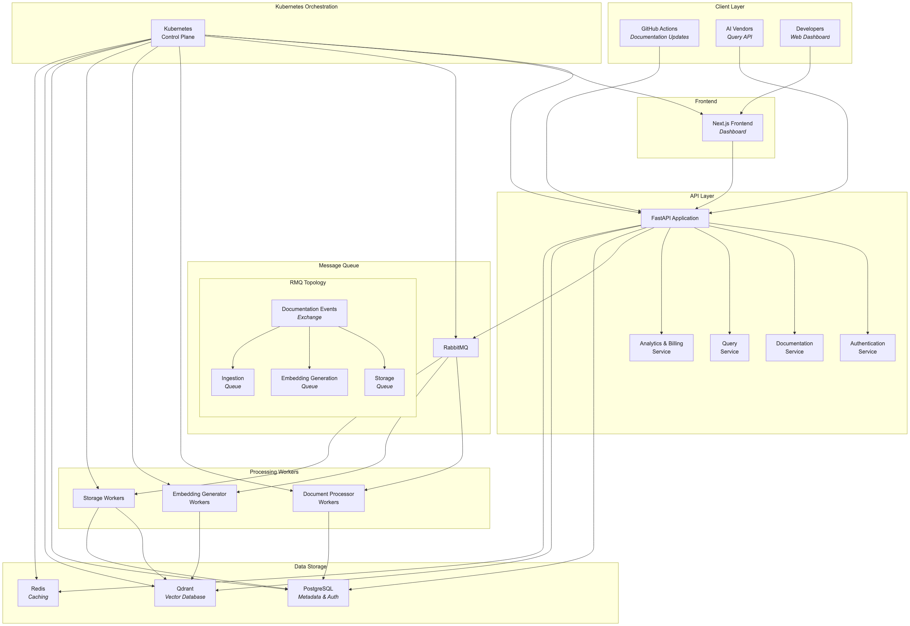
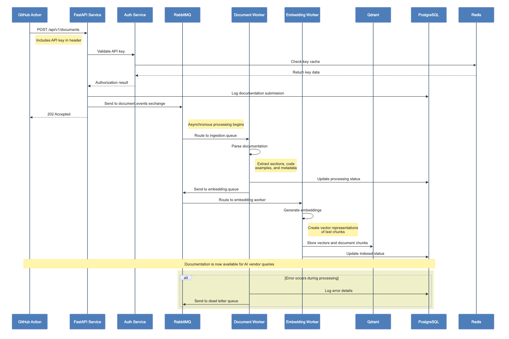
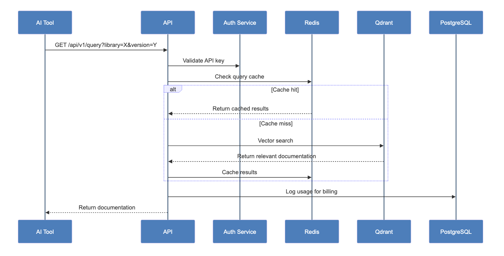
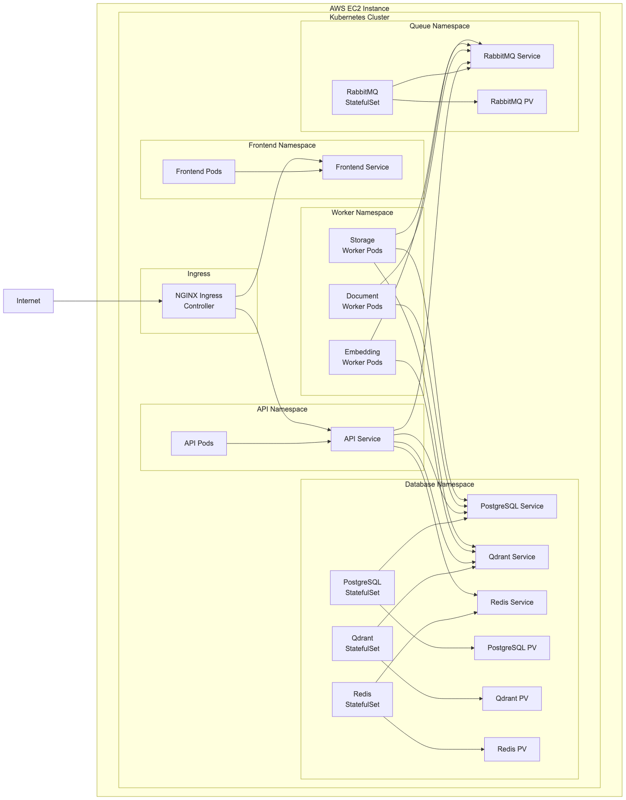
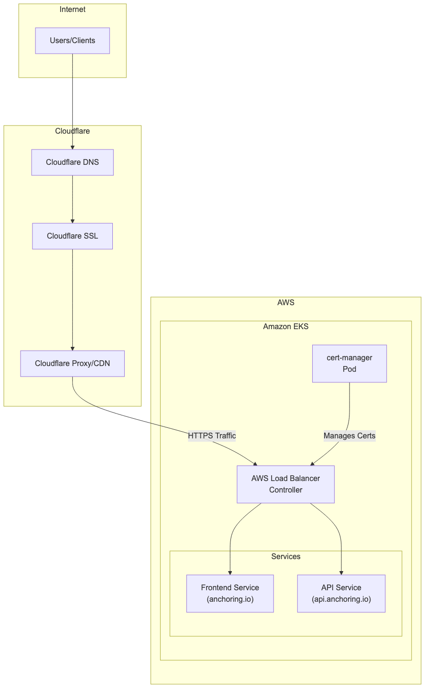

# Anchoring API: Version-Pinning Documentation Service


## 🚀 Overview

Anchoring API is a revolutionary service that bridges the gap between evolving code libraries and AI-assisted coding tools. Our platform enables AI coding assistants (like Cursor, Claude, ChatGPT, and GitHub Copilot) to access and query precise, version-specific documentation, dramatically improving the accuracy of their code suggestions.

**The Problem**: AI tools often generate code with incorrect or outdated syntax because they don't handle version-specific details well. Libraries evolve rapidly, with breaking changes, deprecated methods, and new functions.

**Our Solution**: A central service that provides version-pinned documentation via API, ensuring AI tools always access the correct documentation for the specific library version a developer is using.

## 🌟 Key Benefits

- **For AI Vendors**: Improved accuracy of code suggestions, reduced hallucinations, better user satisfaction
- **For OSS Maintainers**: New revenue stream through our profit-sharing model
- **For Developers**: More reliable, version-correct code suggestions from their AI coding tools

## 🏗️ System Architecture



Our system follows a microservices architecture deployed on Kubernetes, with these key components:

### Client Layer
- **GitHub Actions**: Used by library maintainers to automatically submit documentation when new versions are released
- **AI Vendor Clients**: Query our API for version-specific documentation to improve code suggestions
- **Developer Dashboard**: Web interface for maintainers to monitor usage and revenue

### Application Layer
- **FastAPI Application**: Core backend service with RESTful endpoints
- **Next.js Frontend**: Dashboard interface for maintainers and admin functionality

### Processing System
- **RabbitMQ**: Message queue for handling asynchronous processing tasks
- **Worker Services**: Specialized workers for document processing, embedding generation, and storage

### Data Layer
- **PostgreSQL**: Metadata database (users, libraries, versions, API keys, billing)
- **Qdrant**: Vector database for storing embeddings and enabling semantic search
- **Redis**: Caching layer for API keys and frequently accessed content

## 🔄 Core Workflows

### 1. Documentation Ingestion Flow



### 2. Documentation Query Flow



### 3. Kubernetes Deployment Architecture



### 4. Domain & SSL Architecture


## 💾 Database Schema

### PostgreSQL Models

We use SQLAlchemy with the following primary models:

- **Maintainer**: Library maintainers who contribute documentation
- **Library**: Software libraries tracked in our system
- **LibraryVersion**: Specific versions of libraries
- **APIKey**: Authentication keys for maintainers and AI vendors
- **UsageRecord**: Tracking API usage for billing and analytics

### Vector Database (Qdrant)

Qdrant stores:
- Document text chunks
- Vector embeddings
- Metadata for filtering (library, version, section type)

## 🛠️ Tech Stack

- **Backend**: Python 3.11+ with FastAPI
- **Frontend**: TypeScript with Next.js
- **Databases**: PostgreSQL, Qdrant, Redis
- **Message Queue**: RabbitMQ with Topology Operator
- **Infrastructure**: Kubernetes (K3s) on AWS EC2
- **CI/CD**: GitHub Actions

## 🚀 Development Setup

### Prerequisites

- Docker and Docker Compose
- kubectl

### Local Development

1. Clone the repository:
   ```bash
   git clone https://github.com/your-org/anchoring-api.git
   cd anchoring-api
   ```

2. Create environment files (copy from examples):
   ```bash
   cp ./envs/.env.api.EXAMPLE ./envs/.env.api
   cp ./envs/.env.frontend.EXAMPLE ./envs/.env.frontend
   cp ./envs/.env.worker.EXAMPLE ./envs/.env.worker
   cp ./envs/.env.postgres.EXAMPLE ./envs/.env.postgres
   cp ./envs/.env.qdrant.EXAMPLE ./envs/.env.qdrant
   cp ./envs/.env.redis.EXAMPLE ./envs/.env.redis
   ```

3. Start the development environment:
   ```bash
   docker-compose up -d
   ```

4. Access services:
   - Frontend: http://localhost:3000
   - API: http://localhost:8000/api
   - API Documentation: http://localhost:8000/api/docs

### Running Tests

```bash
# Backend tests
cd services/api
pytest

# Frontend tests
cd services/frontend
npm test
```

## 📦 Project Structure

```
anchoring-api/
├── .github/              # GitHub Actions workflows
├── docs/                 # Documentation files
├── diagrams/             # Mermaid diagram source files and PNG renders
│   ├── *.mmd             # Mermaid diagram source files
│   └── png/              # Generated PNG diagrams
├── services/             # Application services
│   ├── api/              # FastAPI backend
│   ├── frontend/         # Next.js frontend
│   └── worker/           # Processing workers
├── infrastructure/       # Infrastructure configuration
│   ├── kubernetes/       # Kubernetes manifests
│   └── terraform/        # Terraform configuration (future)
├── scripts/              # Utility scripts
├── .env.example          # Example environment variables
└── docker-compose.yml    # Local development setup
```

> **Note on Diagrams**: The diagrams in this README are generated from Mermaid source files in the `diagrams/` directory. If you modify the source files, you can regenerate the PNG images by running:
> ```bash
> # Install the Mermaid CLI tool (one-time setup)
> npm install -g @mermaid-js/mermaid-cli
> 
> # Generate PNG files from Mermaid diagrams
> python scripts/generate_diagrams.py
> ```

### Services Structure

#### API Service (`services/api/`)

```
api/
├── src/                  # Application source code
│   ├── main.py           # Application entry point
│   ├── api/              # API endpoints
│   │   └── v1/           # API version 1
│   ├── core/             # Core application components
│   ├── db/               # Database models and repositories
│   ├── services/         # Business logic services
│   └── dependencies/     # FastAPI dependencies
├── tests/                # Test suite
└── Dockerfile            # Container definition
```

#### Frontend Service (`services/frontend/`)

```
frontend/
├── src/                  # Application source code
│   ├── pages/            # Next.js pages
│   ├── components/       # React components
│   ├── styles/           # CSS/styling
│   └── lib/              # Utility functions and hooks
├── public/               # Static assets
└── Dockerfile            # Container definition
```

#### Worker Service (`services/worker/`)

```
worker/
├── src/                  # Worker source code
│   ├── main.py           # Worker entry point
│   ├── processors/       # Task processors
│   └── utils/            # Utility functions
├── tests/                # Test suite
└── Dockerfile            # Container definition
```

## 🔒 Authentication & Security

### API Keys

- We use API keys for authentication
- Keys are hashed using SHA-256 before storage
- Redis caching for fast validation
- Keys can be scoped with specific permissions
- Automatic key rotation is supported

### Security Measures

- All API endpoints use HTTPS
- Input validation on all requests
- CORS configuration for frontend safety

## 📊 Monitoring & Observability

We plan to implement:

- Prometheus for metrics collection
- Grafana for visualization
- Structured logging with correlation IDs
- Alerting for system health issues
- Request tracing for performance monitoring

## 🧪 Testing Strategy

- **Unit Tests**: For individual components and functions
- **Integration Tests**: For interactions between services
- **End-to-End Tests**: For complete workflows
- **Load Testing**: For performance under heavy usage

## 🚢 Deployment Strategy

### Development Environment
- Docker Compose to replicate the containers
- All components deployed with minimal resources
- Used for feature development and testing

### Production Environment (Future)
- EKS cluster with autoscaling
- Separated database instances for reliability
- High availability configuration
- Geographic distribution for low latency

## 📝 API Documentation

Full OpenAPI documentation is available at `/docs` when the API is running.

Key endpoints include:

- `POST /api/v1/documents`: Submit new documentation (for maintainers)
- `GET /api/v1/query`: Query documentation by library and version (for AI vendors)
- `GET /api/v2/libraries`:  List available libraries
- `GET /api/v1/libraries/{library}/versions`: List available versions
- `POST /api/v1/auth/keys`: Create new API keys
- `GET /api/v1/analytics/usage`: View usage statistics (for maintainers)

## 👥 Team Structure and Responsibilities

We're currently in the pre-MVP stage, with openings for:

- **Backend Engineers**: FastAPI, SQLAlchemy, Vector Databases
- **Frontend Engineers**: Next.js, React, TypeScript
- **DevOps Engineers**: Kubernetes, AWS, Terraform
- **ML Engineers**: Embedding models, Vector search optimization

Each engineer is encouraged to take ownership of components and collaborate across boundaries as needed.

## 📈 Roadmap

### Phase 1: MVP (Current)
- Basic documentation ingestion from GitHub Actions
- Simple query API for AI vendors
- Support for most popular Python libraries
- Basic maintainer dashboard

### Phase 2: Growth
- Support for additional languages (JavaScript, Java, etc.)
- Enhanced analytics and revenue sharing
- Improved search algorithms
- Direct integrations with major AI coding tools

### Phase 3: Scale
- Global distribution for low latency
- Advanced features for maintainers
- Extended enterprise offerings
- Support for private documentation

## 🤝 Contributing

We welcome contributions from team members! To get started:

1. Pick up a task from our issue tracker
2. Create a feature branch (`git checkout -b feature/amazing-feature`)
3. Commit your changes (`git commit -m 'Add some amazing feature'`)
4. Push to the branch (`git push origin feature/amazing-feature`)
5. Open a Pull Request

Please follow our coding standards and include tests for new features.

## 📜 License

This project is licensed under the MIT License - see the LICENSE file for details.

## 📞 Contact

For any questions about the project, reach out to the project lead or check the internal documentation.

---

*Anchoring API - Making AI coding assistants version-aware, one library at a time.*